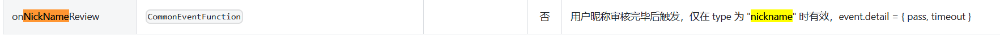
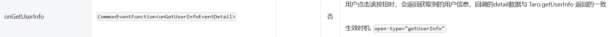
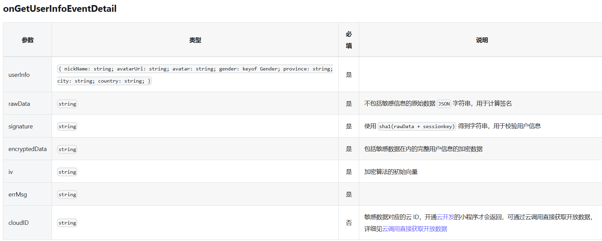

# 进度记录
7.27-7.29 VUE3-Taro-Pina 整合nutUI
但由于考虑到需要整合问答，所以直接使用已经搭建好的项目，进行二次开发
#### 7.29 项目初始化
1. 知识闯关页面开发
2. 答题页面开发
   1. 页面计时器
   2. 答题进度条
   3. 题目和选项
3. 答案解析页面开发
   1. 页面数据获取
   2. 页面初步开发

#### 7.30 项目初步完善
1. 答案解析页面样式开发
2. 业务逻辑：？？？？？？
   1. 闯关成功：下一关，返回->selectKey=key=1，know页面key=1的点击->进入到此用户的答题解析页面
   2. 闯关失败：无下一关，返回->selectKey=key-1=0，know页面key=

#### 展馆首页
1. √ 8.5号 页面样式(假数据)三个Tab页面
2. 展馆详情页面，假数据
   1. 富文本框？？？？

#### 悬浮导航
1. 悬浮导航(选中变红,页面跳转)

#### 公众号文章订阅页面
1. 页面样式

# 代码分析
```tsx
export default () => {
//计时器
  onTimeUp()
  {
    Taro.showToast({
      title: '时间到',
      icon: 'success',
      duration: 2000
    })
  }
  return (
    <AtCountdown
      isShowHour={false}
      minutes={5}
      seconds={0}
      className="progressTime"
      onTimeUp={onTimeUp.bind(this)}
    />
  )
}
```

出错原因：由于使用的是箭头函数（匿名函数）作为默认导出，因此 this 的绑定在箭头函数中不起作用。
需要将 onTimeUp 函数定义在组件内部，并且不需要绑定 this。这里是修改后的代码：
```tsx
export default () => {
  // 计时器
  const onTimeUp = () => {
    Taro.showToast({
      title: '时间到',
      icon: 'success',
      duration: 2000,
    });
  };

  return (
    <AtCountdown
      isShowHour={false}
      minutes={5}
      seconds={0}
      className="progressTime"
      onTimeUp={onTimeUp}
    />
  );
};
```

# 值传输
## 父组件和子组件数据传输
## 页面跳转(页面之间，即必须是在Pages里面的，即是添加到app.config.ts中的页面数据传输)
1. 原页面
   onClick={() => {
   Taro.setStorageSync("exhibitionId",data.id);
   Taro.navigateTo({
   url: "/pages/exhibitionDetail/index",
   });
   }}
2. 目标页面(exhibitionDetail)
   const id=Taro.getStorageSync("exhibitionId");
## 组件->页面数据传输


# 导包顺序
1. 组件(UI)
2. import Taro from "@tarojs/taro";
3. import { useEffect, useState } from "react";
4. 图片/自定义components
5. 最后：import "./index.scss";

# 知识点
1. filter 方法返回数组：filter 方法返回的是一个数组，即使只有一个匹配的项。你需要从数组中取出第一个元素。
   const exhibitionItem=dataList.filter(item => item.id === id)[0];

# 常见报错
要解决这个问题，可以在比较之前检查 correctOption 是否为 undefined/null。
你可以使用可选链操作符 (?.) 来确保代码在 correctOption 为 undefined/null 时不会抛出错误。
1. correctOption is possibly undefined
原先：else if (option.key === correctOption.key) {
   backgroundColor = "#bfd9d0";
   color = "#317a61";
   }

改正：else if (option.key === correctOption?.key) {
backgroundColor = "#bfd9d0";
color = "#317a61";
}

2. correctOption is possibly null

# 根据API文档写代码
## 调用微信小程序的默认登录，并获取信息
1. 获取用户昵称信息：
Input->Props :
就表示：
```tsx
<Input type="nickname" onNickNameReview={getNickName} />
```
并且因为参数类型是CommonEventFunction，所以往onNickNameReview传递的函数时有不同：
```tsx
const getNickName =(e)=>{
  console.log(e.detail);//就可以获取到 用户的昵称 了
}
```

2. 获取用户头像：
    Button->Props :
    就表示：
```tsx
<Button openType="chooseAvatar" onChooseAvatar={getAvatarUrl}></Button>
```
并且因为参数类型是CommonEventFunction，所以往onChooseAvatar传递的函数仍然是：
```tsx
const getAvatarUrl =(e)=>{
  console.log(e.detail.avatarUrl);//就可以获取到 用户的昵称 了
}
```

2. 参数类型不是简单的“CommonEventFunction”，则需要根据API文档来编写特定的：
   1. 比如
      Button->Props :

```tsx
<Button openType="getUserInfo" onGetUserInfo={getGetUserInfo}></Button>
```
就表示：传入onGetUserInfo的参数类型是onGetUserInfoEventDetail

```tsx
const getGetUserInfo =(e:any)=>{
  const {userInfo, rawData, signature, encryptedData, iv, errMsg} = event.detail;
    if (errMsg === 'getUserInfo:ok') {
      console.log('用户信息:', userInfo);
      console.log('原始数据:', rawData);
      console.log('签名:', signature);
      console.log('加密数据:', encryptedData);
      console.log('初始化向量:', iv);

      // 示例：将用户信息保存到状态或发往后端
      console.log(userInfo);
      Taro.showToast({title: '用户信息获取成功', icon: 'success'});
    } else {
      Taro.showToast({title: '用户信息获取失败', icon: 'error'});
      console.warn('获取用户信息失败:', errMsg);
    }
  console.log(e.detail.userInfo.nickname);//就可以获取到 用户的昵称 了
}
```


